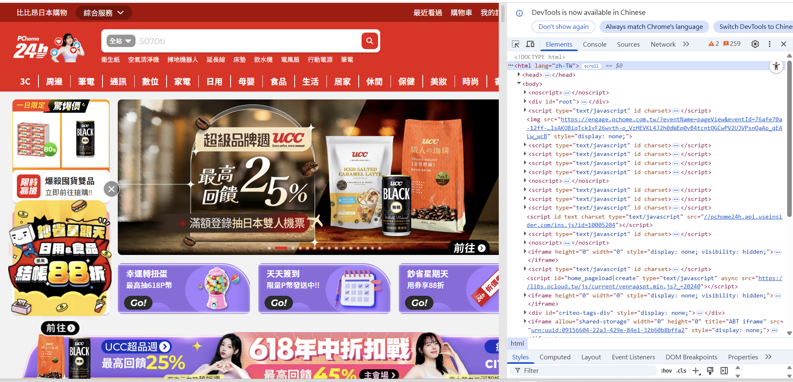

#思涵的網頁

##專案介紹
這是一個內容包含個人基本資料、興趣與自傳，以及我個人網路爬蟲成果的展示，可以透過這個網頁更認識我。

##網站連結
[點我前往](https://elva17.github.io/huang.github.io/)

##頁面介紹
-'intro'=首頁
-'first'=履歷頁
-'second'=成果展示

##使用技術
HTML/CSS/GitHub Pages

##爬蟲

[PChome]([https://www.taiwanbus.tw/ebuspage/Default.aspx?lan=C](https://www.googleadservices.com/pagead/aclk?sa=L&ai=DChcSEwjQjs-nv86NAxUIbQ8CHR8PB74YABABGgJ0Yg&co=1&gclid=Cj0KCQjw0erBBhDTARIsAKO8iqTck1yF26wyth-o_VzHEVKL4J2h0dWEp0vB4tcntQGCwPV2UJVPsnQaAo_qEALw_wcB&ohost=www.google.com&cid=CAESeeD2x71IDFYSS3AZ421Zne8OxKXP8JaQUBQrV5glTlQ6kGY4tEIfdhQDq1BNg6yMCasd5u7WKvIowVGOUdsYVwvWkBuBndAnrfRT-S4ZDED6XzUg_oo6EM3YIlLOrzR09ayLhxt0KmAm8sVr_qHVnwCfrxedO28bJ8I&category=acrcp_v1_40&sig=AOD64_1TSav5fUmZDH9ydBGC_4RvcNBY2w&q&adurl&ved=2ahUKEwjxhcynv86NAxULh1YBHfdYHEcQ0Qx6BAgOEAE))

##作者
靜宜大學，大學部，資科系學生，聯絡方式:s1120106@o365st.pu.edu.tw
